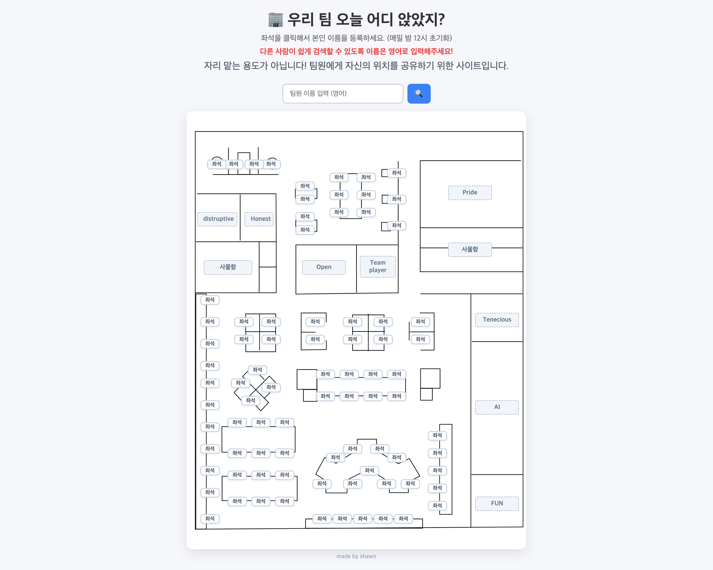

# Office Seat

팀원이 오늘 앉은 좌석을 등록하고 빠르게 찾을 수 있는 자율좌석제 좌석 배치 웹사이트입니다.
웹사이트는 [office-seat.com](https://www.office-seat.com/)에서 확인할 수 있습니다.

## 주요 기능

- 좌석을 선택해 이름과 4자리 비밀번호로 현재 위치 등록
- 등록한 비밀번호 확인 후 좌석 정보 해제
- 팀원 이름 검색 및 해당 좌석 강조 표시
- Supabase Realtime을 통한 좌석 정보 실시간 동기화
- 매일 자정 좌석 정보 초기화 운영을 고려한 안내 문구 제공

## 사용 기술

- HTML, CSS, JavaScript
- Supabase, Vercel